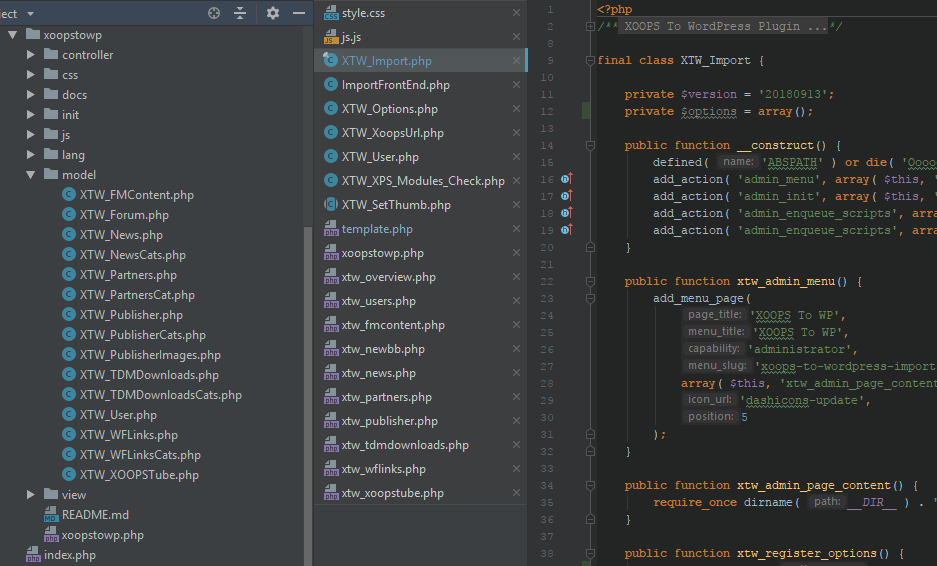
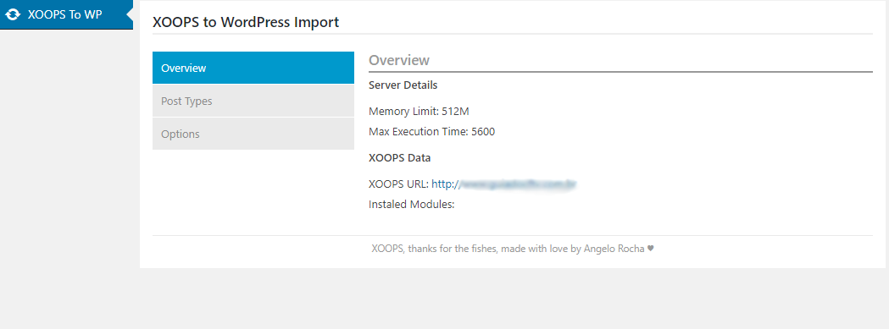

# XOOPS to WordPress
##### XOOPS to WordPress Migration Plugin

# Features
- XOOPS User import;
- Get all content images embed;
- Add featured images in WordPress content;

# Modules
- **newBB**
    - Foruns;
    - Topics;
    - Replies;
    - Add Topic Views;
- News;
    - News Topics;
    - Auto add Featured image;
    - Import inline media to WordPress post content;
- Publisher;
    - Topics;
    - Auto add Featured image;
    - Import inline media to WordPress post content;
- FMContent;
    - Import inline media to WordPress post content;
- Partners;
    - Add post meta with partners fields;
    - Add partners info to WordPress Post Content;
- TDMDownloads;
    - Add post meta with TDMDOwnloads fields;
    - Add TDMDownloads item info to WordPress post content;
- WFLinks;
    - Add post meta with WFLinks fields;
    - Add WFLinks item info to WordPress post content;
- XOOPSTube
    - Auto add youtube video thumbnail to post featured image;
    
# Experimental
##### Redirect all old content to WordPress new Content
<small>(In development)</small>

# [Contact Me](https://angelorocha.com.br/contato-para-criar-sites-portais-e-sistemas-web)
